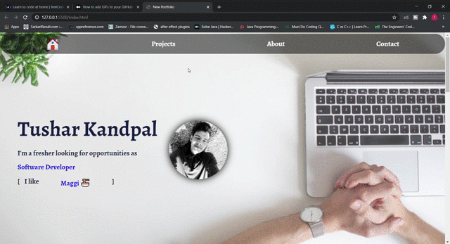

# **PORTFOLIO**

## **Description**

This is my personal portfolio where I implemented & explored all the skills I've learnt (& still learning) after starting my Front-End journey.

***

### 
<a href="https://tusharkandpal.github.io">**Live Demo**</a>

***

## **Screenshots**

***

## **Built Using**

- HTML5, CSS3, JS
- **Frameworks:** Bootstrap 4
- **Libraries:** 
  * Animate.css
  * typed.js
  * GSAP 3.5.1
- **Technologies:** 
  * Git
  * VS Code
***

## **Features**
- Responsive
- Hosted via Github
***

## **Reach Me**

